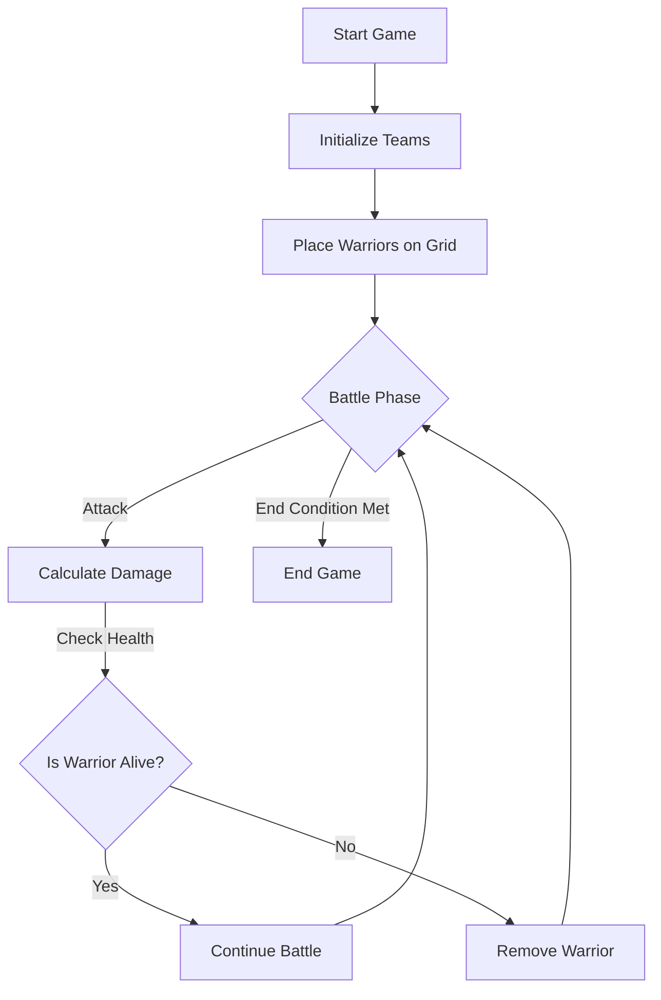

# 🛡️ Battle Simulator - Assignment 1

## 📌 Student Information
- **📝 Student Name:** A&zwnj;l&zwnj;e ███████  
- **🆔 Student Number:** 301207313
- **📚 Course:** COMP392 Advanced Graphics (SEC. 001) Winter 2025

---

## 🎯 Introduction
### Hi Professor,

This is my submission for **Assignment 1**. I’ve implemented the **Battle Simulator** as requested.

I wasn't quite sure what the difference was between `power` and `damagePower`, so I tried to make sense of it by using `power` as a modifier that affects the final damage output. In my implementation, the actual damage dealt during an attack is calculated as:

```cpp
actualDamage = damagePower + (enemy.power - attacker.power);
```

This means that `damagePower` serves as the **base damage value**, while `power` adjusts that base value depending on the relative strength of the **attacker** and the **enemy**. For instance:

- A **Soldier** has a `damagePower` of **15** and a `power` of **10**.
- A **Queen** has a `power` of **20**.

So, when a **Soldier attacks a Queen**, the calculation becomes:

```cpp
15 + (20 - 10) = 25 damage
```

Conversely, when a **Queen attacks a Soldier**, the calculation would lower the damage accordingly. This approach gives both attributes a **clear role in the combat mechanics**.

I hope you find everything in order. Thanks! 😊

---

## 📂 Files Included

```bash
📁 Battle Simulator
├── 📝 Warrior.h / Warrior.cpp                 # Base class for all warriors
├── 📝 Soldier.h / Soldier.cpp                 # Soldier class
├── 📝 Queen.h / Queen.cpp                     # Queen class
├── 📝 Team.h / Team.cpp                       # Manages a team of warriors
├── 📝 BattleSimulator.h / BattleSimulator.cpp # Handles the game logic and grid management
├── 📝 main.cpp                                # The main file where the program starts
├── 📄 README.md                               # This file
└── 📁 Battle Simulator Precompiled            # Folder containing the precompiled executable
```

---

## ⚙️ Compilation Instructions

You can compile this program using **g++** from the command line. Ensure that **g++** is installed on your system and its directory is added to your `PATH`.

### On **Windows** using CMD:

1. **Open a CMD window**:
   - Press `Win + R`, type `cmd`, and press `Enter`.

2. **Navigate to the project folder**:
   ```bash
   cd "D:\COMP392\Assignment 1"
   ```

3. **Compile the program**:
   ```bash
   g++ -o BattleSimulator src\main.cpp src\Warrior.cpp src\Soldier.cpp src\Queen.cpp src\Team.cpp src\BattleSimulator.cpp
   ```

4. **Run the program**:
   ```bash
   BattleSimulator.exe
   ```

If you encounter any issues during compilation, a **precompiled executable** is available in the `Battle Simulator Precompiled` folder.

---

## ▶️ Running the Program

When running the executable by **double-clicking**, the console window may open and close immediately. To keep the window open and see the output, open a **CMD** or **terminal** in the directory where `BattleSimulator.exe` is located and **run it from there**:

```bash
cd "D:\COMP392\Assignment 1"
BattleSimulator.exe
```

---

## 🔧 Notes

- You can tweak the **grid size** and the **number of warriors** by modifying `main.cpp` or the `BattleSimulator.cpp` constructor.

---

## 📊 Game Overview

Here's a brief overview of the game mechanics:




---


# Thanks :)

